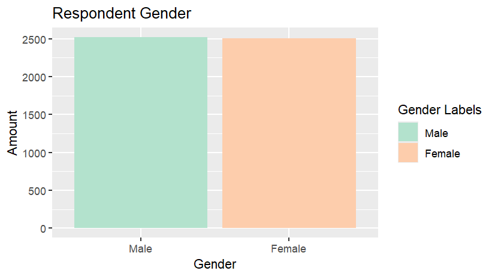
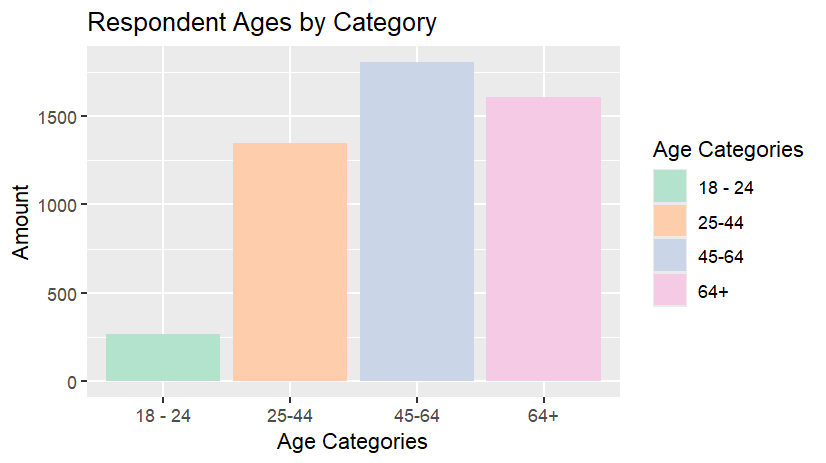

# Covid-19-Survey-Data-Analysis
Analysis and visualization of a survey regarding attitudes regarding vaccination and other aspects of the Covid-19 Pandemic
# COVID Survey Analysis

## Overview
This project explores demographic characteristics and selected vaccination-related variables from a publicly available Health and Human Services COVID-19 survey dataset. Data cleaning, visualization, and exploratory statistical analyses were conducted using R

## Dataset
Data were obtained from https://healthdata.gov/Health/HHS-COVID-19-Monthly-Outcome-Survey-Wave-17/duxn-gw43/about_data

## Methods
- Data cleaning
- Data visualization using ggplot2
- Correlation analysis using Base R functions 

## Files
- covid_data_visualization.R : Main analysis script
- figures/ : Generated visualizations

## Key Findings
- In terms of race, the vast majority of participants identified as White,
non-Hispanic. 
-In terms of gender, there was an essentially equal amount of men and women who
participated in the survey.
- In terms of age, the vast majority of participants were 25 years of age or more. 
- A weak positive association were found between receiving 1 or 2 COVID-19 vaccinations and income(r = .18, p < 2.2e-16). 
- A similar result was found for receiving 1 or 2 vaccinations and age(r = .15, p < 2.2e-16).
- No correlation was found between having a child between the ages of 0-4 and having difficulties performing certain tasks due to nervousness. 

## Limitations
- Both age and income were presented as categories rather
than numerical values, meaning this result should be taken with caution. 
- Questions regarding having a child from 0-4 and having difficulties performing certain tasks due to nervousness were skipped by majority of respondents, potentially leading to the null result.
- Pearson's was used for all correlational tests, but since having a child from the ages of 0-4 was recorded as a binary variable, this result should be interpreted as a rough association. 
- Survey weights provided with the dataset were not incorporated into the analysis. 

## Tools Used
- R
- RStudio
- tidyverse
- Readxl

## Visualizations

### Respondent Gender

### Respondent Age Categories

### Respondent Race

 
